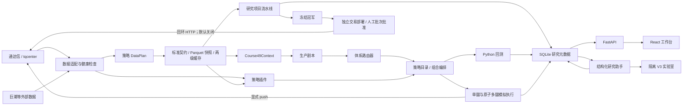

# 平台架构

## 设计原则

通达信负责它擅长的数据、行情界面和客户端联动；Python 负责可测试的计算、回测、组合约束和研究记录。标准数据层不是复制一套行情库，而是在策略入口统一字段、单位、复权、时区和可用时间，并为每次研究保存可追溯快照。

## 模块边界

- `research_platform/data.py` 只负责数据获取、字段规范化、质量检查和 TDX 回传。
- `research_platform/strategies/` 保存内置策略和 `course49_system` 框架；`strategy_plugins/` 通过 API V1 清单动态发现可信本地插件。每个插件声明版本、资产、频率、数据依赖、运行适配器、执行模型和审批要求。
- `course49_system.py` 每个交易日只构建一次版本化 `Course49Context`。纯函数剧本共享该上下文，路由器统一执行风险优先、去重、确定性排序和资金预算；剧本不得访问 TQ、数据库或订单接口。
- `composition.py` 管理策略目录及资金分舱、信号加权、交集确认、风险覆盖和对照实验。
- `portfolio.py` 只解释已批准的单腿信号或多腿意图；多腿任一腿不可成交时整组不成交。
- `backtest_engine.py` 通过运行适配器路由：缠论和49课保留专用适配器，其他日线单腿/多腿策略复用通用事件执行器；通达信 Lambda 暂作为未来的交叉验证通道。
- `data_plan.py` 合并策略数据声明，只读取实际股票池、字段、复权、指数、板块和事件；`data_cache.py` 提供 24GB 进程内 LRU、50GB 磁盘治理、区间覆盖匹配和 single-flight。
- `storage.py` 使用 Schema V13 保存框架、剧本、每日漏斗状态、来源归因、运行、成交、权益、快照依赖、缓存索引、周线观察账本，以及研究项目、历史分片、模型版本、冠军验证、交易部署、不可变订单批次、券商委托/成交、持仓快照、对账、风险事件和调度心跳；旧 Course49 账户冻结但不迁移或删除。
- `early_winner_research.py` 管理 `research_project` 的 TDX/巨潮准入、点时特征、规则榜、固定 ML、同快照验证和运行文件哈希；该层不调用交易或通达信推送接口。
- `early_winner_trading.py` 保留历史部署状态机供研究审计；paper-only 构建不挂载其 API，默认 TDX 客户端的下单和撤单方法永久抛错，研究策略不能导入或调用该服务。
- `api.py` 暴露本地任务和查询接口；最多三个纯快照回测并行，所有 TQ 调用由进程锁和 Windows 跨进程锁共同串行。
- `ai_research.py` 只消费经过裁剪的确定性证据并生成严格结构化结果；模型失败不影响扫描事务。
- `strategy_lab.py` 负责 V3 变体生成、静态检查、子进程验证、快照回放和人工晋级，未验证源码不进入服务进程。

## 运行状态

运行使用 `QUEUED -> RUNNING -> SUCCEEDED`，异常分为 `BLOCKED_DATA` 与 `FAILED`。日线健康不合格会阻断全部策略。Course49 大小盘基准缺失时仅阻断新仓，持仓退出状态仍持续计算。默认扫描为 `course49_system`。`combined` 保留 `chan_v1 50% + course49_system 50%` 的历史比较，`adaptive_multi_strategy` 保留 35%/25%/40% 的 49课体系、缠论与配对套利历史分舱；两者都只支持回测。缠论与配对套利 V1 均为 `HISTORICAL_REJECTED`，不能通过组合间接进入扫描。

信号加权、交集确认和风险覆盖当前用于扫描；只有资金分舱与对照实验进入统一回测。该限制由策略目录的 `backtest_supported` 明示并由后端强制校验。
