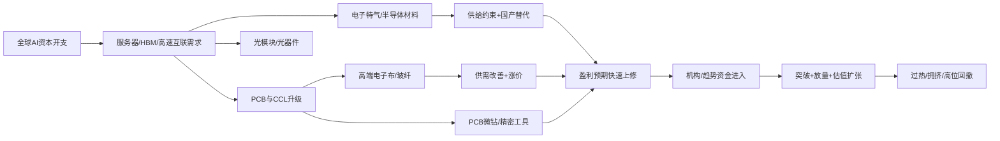
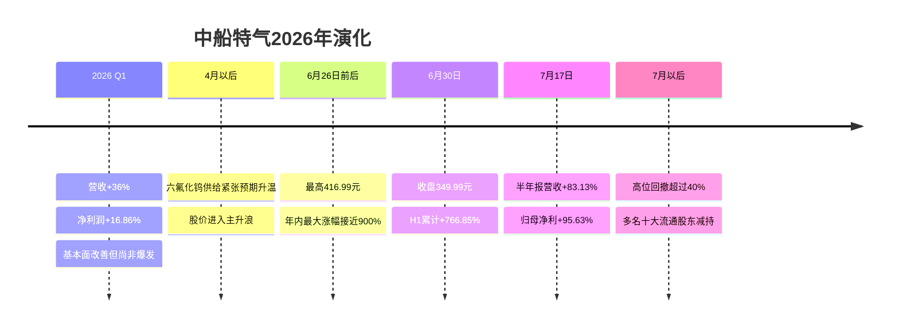
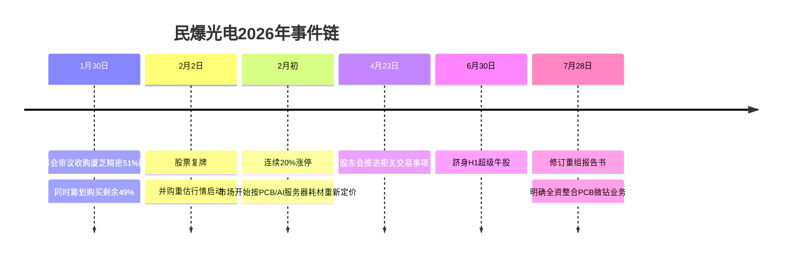
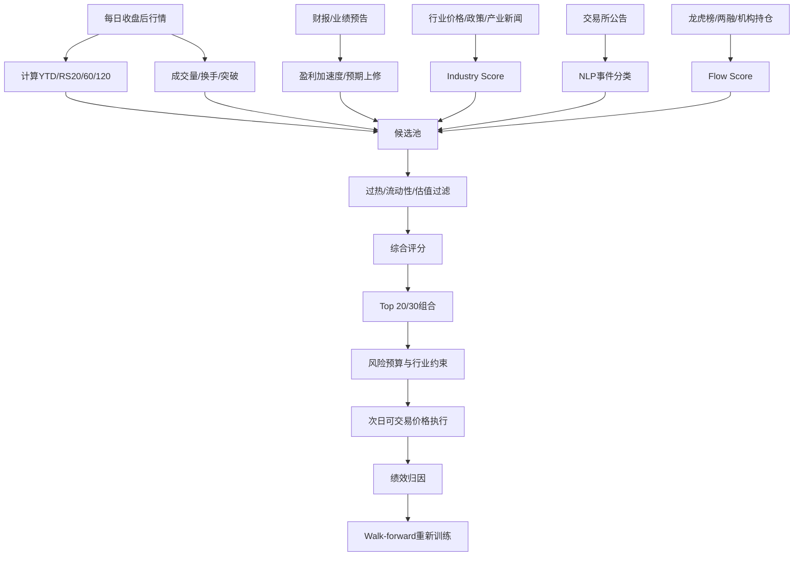

# 2026年A股高涨幅股票深度研究：上涨演化逻辑、可借鉴因子与程序化框架

## 执行摘要

**研究区间。** 用户未指定起止日，本报告按“今年年初至今”处理，即以 **2025年末复权收盘价为基准，观察至2026年8月10日A股收盘**。需要先说明一个重要的数据约束：Wind、同花顺 iFinD 对2026年上半年榜单有公开、可交叉验证的数据，东方财富现货接口也明确提供“年初至今涨跌幅”字段；但本研究环境无法直接执行东方财富动态行情接口，因此我**不把6月30日榜单或滚动6个月榜单伪装成8月10日实时YTD Top30**。下文把“已核验的上半年超级牛股”作为核心样本，再用当前滚动6个月高涨幅股作为候选扩展池，并给出一套可以在 Wind/Choice/iFinD/AKShare 上一次性重建“截至8月10日精确Top30”的代码。AKShare公开文档显示，`stock_zh_a_spot_em` 直接返回包括“年初至今涨跌幅”、换手率、动态PE、PB等字段，`stock_zh_a_hist` 则可取得日线OHLC、成交量、成交额和换手率，因此这个缺口是**数据访问限制，而不是方法不可实现**。citeturn7view0turn7view1turn17view0

2026年的“牛股”不是普涨背景下随机产生的。Wind及公开市场统计显示，上半年上证指数仅上涨3.16%，深证成指上涨19.82%，创业板指上涨35.58%，科创50上涨64.25%；约5500只股票中只有约1700只上涨，360多只翻倍，而个股涨跌幅中位数约为-15.5%。换言之，这是一个**极端K型、少数产业主线集中贡献收益**的市场。电子和通信分别成为上半年最强申万一级行业之一，涨幅约86.29%和73.59%。citeturn22search0turn24search13turn27image1

最值得注意的是，超级牛股高度聚集在 **AI基础设施上游“卖铲人”**：电子特气、覆铜板CCL、电子玻纤布、PCB微钻、光通信、存储芯片，以及AI算力租赁。Wind/iFinD口径下，中船特气上半年上涨766.85%，宏和科技621.08%，金安国纪619.72%，宏景科技600.76%，其后利通电子、国际复材、海星股份、民爆光电、杭电股份、光智科技均超过500%；财联社统计共有12只存量股半年涨幅超过500%。citeturn27image1turn24search13turn31search11

这种行情的典型演化不是简单的“业绩好→股价涨”，而是：

> **产业趋势出现 → 供需缺口/政策/并购形成催化 → 龙头首先突破 → 板块宽度扩大、成交量和换手率放大 → 盈利预期上修 → 财报开始验证 → 估值与盈利同时扩张 → 资金极度拥挤 → 股价远超当期盈利兑现 → 风险提示/股东减持/机构退出 → 高位大幅回撤。**

中船特气是最完整的例子：二季度股价从42.56元附近最高升至416.99元，而上半年营收最终同比增长83.13%、归母净利润增长95.63%；基本面确实大幅改善，但股价上涨幅度仍远超同期利润增长。随后从高位回撤超过40%，二季度十大流通股东中有8席减持，包括国家集成电路产业投资基金，股东户数较一季度末增长超过两倍。citeturn34search1turn34search9

因此，**真正值得程序化借鉴的不是“追过去涨得最多的股票”，而是尽量在上述演化链条的第二至第五阶段发现股票**：产业景气正在加速、产品价格或订单出现拐点、盈利预期开始上修、股价刚刚突破而尚未进入垂直加速。后半段的“涨幅榜策略”本身往往具有非常严重的反转风险。7月的市场已经演示了这一点：大量上半年超级牛股从6月高位回撤30%—50%，同时7月市场风格一度由科技切向红利、煤炭、银行等方向。citeturn2search0turn0search16

**程序化可行性很高，但需要把“价格动量”升级成“产业景气 × 基本面上修 × 价格突破 × 事件催化 × 拥挤度控制”的多层模型。** 单纯用60日涨幅、突破新高或者放量容易在加速末期接盘；加入季度盈利加速度、产品价格趋势、板块宽度、公告NLP事件评分，以及换手/估值/涨幅过热过滤后，策略逻辑明显更接近今年真实牛股的形成机制。

本报告最核心的量化结论可以概括为：

**买“正在变好而市场开始相信”的公司，而不是买“已经涨得最好”的公司；卖出条件则重点监控“价格继续加速、盈利预期不再上修、机构开始减仓”的组合。**

## 研究口径、数据体系与指标定义

### 研究对象和榜单口径

严格的YTD收益定义为：

\[
R_{YTD,i}=\frac{P^{adj}_{i,2026-08-10}}{P^{adj}_{i,2025-12-31}}-1
\]

其中 \(P^{adj}\) 为经过除权除息处理后的可比价格。对于2026年内上市的新股，由于不存在2025年末基准价格，应单独建立“次新股榜”，否则首日涨幅会严重污染普通股票的YTD排名。Wind/iFinD公开的上半年牛股统计也通常对年内上市新股或上市不足一定时间的股票做剔除。citeturn22search0turn24search13turn31search11

因此程序化研究建议同时维护三个Universe：

| 股票池 | 定义 | 用途 |
|---|---|---|
| 全A YTD | 当日所有正常上市A股 | 与行情软件一致的市场榜单 |
| 存量A股 | 2025-12-31前已上市 | 本报告主要研究口径 |
| 可交易量化池 | 存量A股，再过滤ST、长期停牌、极低流动性、上市不足120日 | 回测和实盘 |

截至6月30日，Wind公开的Top20全部上涨超过400%；前十中中船特气、宏和科技、金安国纪、宏景科技均超过600%。citeturn31search3turn31search11


[下载高清涨幅前十图](sandbox:/mnt/data/2026H1_A股涨幅前十.png)

图中数据采用Wind/iFinD公开可交叉验证口径，截至2026年6月30日。citeturn27image1turn31search11

### 需要保存的基础数据

完整研究表不应该只是一个“涨幅榜”，而应建立证券—日期二维面板：

| 数据组 | 核心字段 | 推荐来源 | 用途 |
|---|---|---|---|
| 行情 | 前/后复权OHLC、成交量、成交额、换手率、涨跌停状态 | 上交所/深交所、Wind、Choice、iFinD、东财 | 动量、突破、波动率、流动性 |
| 估值 | PE-TTM、PB、PS、EV/EBITDA、行业估值分位 | Wind/Choice/iFinD | 判断估值扩张 |
| 财务 | 营收、归母净利、扣非净利、毛利率、ROE、现金流 | 公司公告、交易所 | 盈利验证 |
| 股东 | 前十大流通股东、机构持股、基金持仓、股东户数 | 公司定期报告、Wind/Choice | 筹码变化 |
| 资金 | 两融、龙虎榜机构席位、陆股通持仓变化 | 交易所、Wind/Choice/东财 | 资金验证 |
| 产业 | 商品价格、产品报价、订单、产能、开工率 | 行业协会、Wind、券商产业数据库 | 景气因子 |
| 事件 | 业绩预告、并购、定增、重大合同、风险提示、政策 | 交易所/巨潮资讯 | Event alpha |
| 情绪 | 涨停数、连板高度、行业涨停扩散、市场成交额 | 交易所/行情终端 | 拥挤度和风险偏好 |

尤其需要区分 **“主力资金”** 和真正可审计的机构资金：同花顺、东方财富等终端提供的“主力净流入”通常属于供应商依据大单成交进行的分类指标，并不是交易所定义的一个独立账户类别；更严谨的机构验证应优先使用龙虎榜机构席位、两融、定期报告持仓和陆股通持股变化。同花顺当前涨跌幅页面同时展示资金净流入和换手数据，可以作为交易行为因子，但不应把它直接等同于“机构买入”。citeturn25view0turn22search6

### 分析指标定义

**价格形态。** 对每只股票计算20、60、120日收益率、年内最大涨幅、最大回撤、距离60/120/250日新高的距离，并用Peak-Trough算法自动把行情切成“吸筹—突破—加速—顶部—回撤”阶段。

**量价突破。**

\[
Breakout_{60}=1(P_t>\max(P_{t-60:t-1}))
\]

\[
VolumeRatio_{20}=\frac{Volume_t}{MA_{20}(Volume)}
\]

推荐把“60日新高 + VolumeRatio>1.5 + 20日成交额分位>60%”作为第一层突破信号，而不是仅使用单日涨停。

**基本面加速度。**

\[
EarningsAccel = z(\Delta Revenue_{YoY})+z(\Delta Profit_{YoY})+
0.5z(\Delta GrossMargin)
\]

同时计算TTM净利润增长、ROE变化和经营现金流。如果利润暴增来自低基数，则增加“环比增长”和“两年复合增长”约束。

**估值—增长匹配。**

\[
ValuationGap=z(PE_{industry\ percentile})-z(EarningsRevision)
\]

PE无意义的亏损股改用PS。真正危险的状态并非“PE绝对高”，而是**估值继续快速扩张、盈利预期却停止上调**。

**行业扩散。** 对申万二/三级行业计算：

\[
Breadth=\frac{N(P>MA20)}{N_{industry}}
\]

再加上行业20日超额收益、行业成交额占全市场比重和创新高股票比例。很多超级牛股出现前，通常不是一只股票孤立上涨，而是其上下游逐渐形成集群。2026年上半年覆铜板、半导体设备、玻纤等主题指数涨幅显著领先市场，是典型的行业扩散环境。citeturn31search3turn2search12

**事件关联。** 对公告日 \(t_0\) 做事件研究：

\[
CAR[-1,+5]=\sum_{t=-1}^{5}(R_{stock,t}-R_{benchmark,t})
\]

并把公告分类为业绩上修、产品涨价、扩产、大订单、并购、股权变化、政策受益、澄清、风险提示等。如果一类事件在历史样本中持续产生正CAR，才能把它纳入程序化因子。

## 高涨幅股票画像与市场演化

### 已核验核心样本与当前候选池

下面的表需要特别阅读“涨幅口径”一列。

**A组前12只是公开资料能够严格确认的2026H1超级牛股；B组18只是截至当前搜狐滚动半年排名中的高涨幅候选，用来寻找7—8月可能发生的榜单迁移，不应把其滚动6个月收益误当成年初至今收益。** 搜狐自己明确说明其阶段排行按复权价格计算；其中凯格精机等出现异常大的滚动复权收益，也恰恰说明正式量化研究必须自行处理除权、送转和公司行为，而不能直接抄网页排行榜。citeturn21view0

| 代码 | 股票 | 公开可核验涨幅 | 研究标签/主要驱动 | 程序化 |
|---|---|---:|---|---|
| 688146 | 中船特气 | H1 **+766.85%** | 六氟化钨供给收缩+AI/HBM需求+产品涨价+盈利兑现 | **高** |
| 603256 | 宏和科技 | H1 **+621.08%** | AI服务器PCB→高端电子布涨价+产品结构升级 | **高** |
| 002636 | 金安国纪 | H1 **+619.72%** | CCL供需改善、量价齐升、利润高弹性 | **高** |
| 301396 | 宏景科技 | H1 **+600.76%** | 从智慧城市向AI算力服务转型 | 中高 |
| 603629 | 利通电子 | H1 **+570.96%** | 原业务之外扩张AI算力租赁 | 中高 |
| 301526 | 国际复材 | H1 **+566.71%** | 玻纤/电子材料产业链景气 | 高 |
| 603115 | 海星股份 | H1 **+554.57%** | 电子材料景气+资金集中 | 中 |
| 301362 | 民爆光电 | H1 **+520.29%*** | 收购厦芝精密，切入PCB/AI服务器微钻 | **高：事件型** |
| 603618 | 杭电股份 | H1 **+518.86%** | 光通信/线缆产业链重估 | 中高 |
| 300489 | 光智科技 | H1 **+514.07%** | 光通信/半导体材料主题+高弹性 | 中高 |
| 688766 | 普冉股份 | H1 **>+503%** | 存储芯片景气/AI存储 | **高** |
| 003036 | 泰坦股份 | H1 **>+500%** | 题材扩散和高换手；需重视公司澄清 | 低—中 |
| 301338 | 凯格精机 | 6M候选 +6457.69% | **复权/公司行为异常需先校正** | 价格可做，榜单不可直接用 |
| 301369 | 联动科技 | 6M候选 +1313.95% | 半导体设备候选 | 高 |
| 003018 | 金富科技 | 6M候选 +1305.65% | 当前阶段异动，需事件复核 | 中 |
| 301005 | 超捷股份 | 6M候选 +760.19% | 高端制造/事件弹性候选 | 中 |
| 301189 | 奥尼电子 | 6M候选 +753.26% | 电子终端/主题驱动候选 | 中 |
| 301312 | 智立方 | 6M候选 +735.19% | 自动化检测/电子设备候选 | 高 |
| 001359 | 平安电工 | 6M候选 +561.71% | 新材料/电气绝缘候选 | 中 |
| 300209 | 行云科技 | 6M候选 +531.41% | 高换手事件型候选 | 低—中 |
| 301018 | 申菱环境 | 6M候选 +508.71% | 数据中心温控/AI基础设施 | **高** |
| 301529 | 福赛科技 | 6M候选 +492.31% | 制造业景气/事件候选 | 中 |
| 300394 | 天孚通信 | 6M候选 +387.90% | 光器件/CPO/AI互联 | **高** |
| 001400 | 江顺科技 | 6M候选 +378.74% | 高端制造候选 | 中 |
| 301086 | 鸿富瀚 | 6M候选 +377.73% | 电子功能材料/散热链候选 | 中高 |
| 301377 | 鼎泰高科 | 6M候选 +324.18% | PCB微钻/精密工具 | **高** |
| 300903 | 科翔股份 | 6M候选 +310.50% | PCB产业链 | **高** |
| 300502 | 新易盛 | 6M候选 +302.55% | AI光模块/高速互联 | **高** |
| 301093 | 华兰股份 | 6M候选 +294.15% | 独立事件/基本面候选 | 中 |
| 002969 | 嘉美包装 | 6M候选 +282.09% | 事件/资本运作属性较强 | 低—中 |

\* 民爆光电不同数据供应商公开报道中存在约520%与541%的口径差异，这进一步说明正式回测应统一复权和起止日，不宜混用媒体数字。前十精确值采用Wind/iFinD公开图表；普冉、泰坦采用新华财经“分别逾503%、逾500%”口径。citeturn27image1turn31search4turn24search13
B组候选的代码和滚动半年收益来自搜狐阶段涨跌排行，只用于候选发现。citeturn21view0

**真正的截至8月10日YTD Top30应重新运行排序，而不是把上表直接当成最终排名。** 东方财富现货数据字段本身存在“年初至今涨跌幅”，因此在研究生产环境中重新排序只需几秒。citeturn7view0turn17view0

### 牛股并不是一个行业，而是同一条经济链

把前12只超级牛股按“上涨驱动力”而不是申万行业重新分类，会得到非常明显的聚集：


[下载高清驱动结构图](sandbox:/mnt/data/2026H1_超级牛股驱动结构.png)

这里的分类是研究者按照上涨逻辑进行的分类，并非正式行业分类。核心现象是：电子材料、PCB、AI算力和高速互联占据绝对主导。财联社对上半年榜单的复盘同样指出，PCB和算力产业链大量进入涨幅榜前列；宏景科技和利通电子都是从原有业务向算力租赁扩张，民爆光电则依靠并购切入PCB微钻。citeturn24search13

换句话说，2026年的核心赚钱逻辑更接近：



这条产业链可以解释为什么表面上完全不同的“气体公司、玻纤公司、线缆公司、精密钻头公司、算力租赁公司”会在同一时期进入超级牛股榜。宏和科技向特定对象发行材料中也明确讨论了AI服务器和数据中心扩容对PCB、高性能电子布需求的推动。citeturn33search0

### 行情经历了非常清晰的阶段演化

**年初至4月：题材发现和产业链扩散。** 截至4月10日，剔除年内上市新股后已有58只股票年内翻倍，机械设备11只、电子8只、环保6只，通信、计算机、电力设备等也开始出现牛股；长飞光纤等AI数据中心相关标的已经表现突出。与此同时，也出现法尔胜、通鼎互联等公司对市场概念进行澄清的案例，说明此时“产业逻辑”和“题材映射”已经开始分化。citeturn22search1turn1view2

**4月至6月：产业价格和业绩成为主导。** 上半年覆铜板、半导体设备、玻纤等主题指数出现百个百分点级的上涨；中船特气的六氟化钨供给危机、宏和科技电子布量价改善、金安国纪CCL价格上涨开始从“故事”变成“盈利预期”。citeturn31search3turn23search3

**6月：进入垂直加速。** 全市场出现12只涨幅超过500%的股票，中船特气盘中年内最大涨幅一度接近900%；这一阶段继续参与虽然还能取得极高收益，但风险收益比已经明显恶化。citeturn24search13

**7月：估值消化和风格切换。** 截至7月14日，年内最大涨幅超过300%的94只股票，相对6月以来高点平均回撤已超过30%；中船特气从高点回撤超过40%，多只上半年超级牛股出现30%—50%级回撤。同时7月红利、煤炭、银行相对占优，科技板块经历明显修正。citeturn2search0turn0search16

**8月初：产业逻辑没有完全消失，但进入“核心反弹+新分支轮动”。** 电子特气、钨、半导体材料等仍会因供需消息重新活跃；8月4—5日电子特气概念再次上涨，中船特气等参与反弹，但这已经与4—6月的“单边估值扩张”不同，更接近高波动、高分化环境。citeturn23search1

这意味着程序化策略必须具备**状态识别**：同样一个“60日新高”信号，在产业启动期与半年上涨600%之后，其未来期望收益完全不同。

## 典型个股案例与上涨演化

### 中船特气：最标准的“供需缺口—涨价—盈利兑现—估值过冲”

中船特气是今年最值得研究的案例，因为上涨链条的每一步都可以量化。

公司一季度实现营收7.01亿元，同比增长36.00%；归母净利润1.01亿元，同比增长16.86%，ROE约1.73%。这时基本面已经向好，但并不能解释后来数倍上涨。citeturn22search2

真正改变市场预期的是二季度六氟化钨产业供需。市场报道显示，日本相关厂商因钨原料供应问题退出或收缩供应，而AI芯片、先进制程和存储扩产又增加六氟化钨需求；市场价格迅速上涨。需要强调，产品市场报价来自产业渠道，不应与上市公司正式公告的合同价格混为一谈，公司也曾对市场过热预期进行风险提示。citeturn23search3turn24search13

股价随后发生“二阶导数”变化：证券时报复盘显示，中船特气二季度从约42.56元一路升至416.99元，最高接近十倍；6月30日收于349.99元，上半年涨766.85%。citeturn34search9turn27image0

财报最终部分兑现了故事：公司2026H1实现营收19.04亿元，同比增长83.13%；归母净利润3.48亿元，同比增长95.63%；扣非净利润3.26亿元，同比增长117.08%。但经营现金流转为-2.41亿元，公司解释与备货、原材料价格上涨以及账期有关。citeturn34search1turn34search15



最重要的现象在顶部之后：半年报很好，但股价没有因为“好业绩”继续线性上涨。二季度十大流通股东中8席出现减持，包括国家大基金，同时股东户数较一季度末增加超过两倍。citeturn34search9

这说明牛股研究必须把：

\[
\text{盈利改善}
\]

和

\[
\text{盈利改善已经被股价计价多少}
\]

分开。

**可以程序化的先行信号：** 产品价格上行、行业供需新闻NLP、季度营收加速度、行业相对强度、60日突破、量能扩张。

**可以程序化的退出信号：** 60日收益进入全市场99分位、价格/盈利预期背离、股东户数突然激增、重要股东减仓、行业宽度下降、从高点回撤突破ATR/波动率止盈线。

### 宏和科技：产品涨价与盈利弹性的“基本面趋势股”

宏和科技比中船特气更接近传统基本面趋势投资。

公司核心产品为电子级玻纤布，AI服务器、高速通信对更高性能PCB和CCL的需求推动低介电、高性能电子布升级；公司公开再融资材料亦明确将AI服务器、数据中心和高频通信视为高性能电子布需求增长的重要来源。citeturn33search0

一季度财务数据出现巨大加速度：营收4.42亿元，同比增长79.72%；归母净利润1.40亿元，同比增长354.22%；ROE约5.06%。公司解释主要由于普通E玻璃纤维电子布销售数量和单价上升，以及特种电子布销售数量增加。citeturn34search6turn34search19

随后公司7月披露的上半年业绩预告进一步验证：预计归母净利润3.32亿—4.05亿元，同比增长280%—364%；扣非净利润同比预计增长294%—381%，原因仍是终端需求增加、电子布价格上涨以及高端产品结构改善。citeturn34search2

这类股票对量化研究最有价值，因为它包含三种可以同步观察的因子：

\[
价格动量 \uparrow
\]

\[
产品售价/景气 \uparrow
\]

\[
盈利预测/实际盈利 \uparrow
\]

只要这三个箭头同时向上，趋势通常比纯题材更稳定。

但机构行为也说明后半程风险上升。公开持仓数据表明，陆股通截至6月30日持有宏和科技约530.94万股，持股数量较上季度减少27.77%；即使持仓市值因股价大涨而提高，股份数量本身已经出现下降。citeturn2search6

因此，一个实用的量化信号不是“机构持仓市值增加”，而应该计算：

\[
\Delta SharesHeld
\]

因为上涨600%的股票即使机构减仓，持仓**市值**仍可能增加。

### 金安国纪：周期涨价遇到利润基数弹性

金安国纪体现的是另一类经典牛股：**行业价格周期转折+低利润基数+利润率扩张**。

公司2026Q1实现营收12.60亿元，同比增长31.36%；归母净利润2.02亿元，同比增长763.91%。相关数据还显示一季度毛利率提升至26.44%，说明利润增长并不只是收入增长，而是利润率同步扩张。citeturn34search3turn34search11

到7月，公司预计2026H1归母净利润7.30亿—8.20亿元，同比增长约936%—1063%，解释是覆铜板和半固化片供不应求、销量增加、售价持续上涨并带动毛利率提高。citeturn34search20

这个案例对程序化研究的启示非常直接：

> **最强周期股通常不是“商品价格涨”一个因子，而是“产品价格涨 + 销量涨 + 毛利率涨”。**

可以构造：

\[
CycleScore =
z(ProductPriceMomentum)
+z(RevenueGrowth)
+z(GrossMarginChange)
\]

如果只有原料或产品价格上涨、销量下降，则可能只是成本通胀；三者同向才更可能出现利润弹性。

但金安国纪同样说明“业绩继续很好”和“股价继续创新高”不是同一回事。搜狐行情截至8月7日显示其年内涨幅约303.8%，仍然非常高，但显著低于6月末619.72%的上半年涨幅，意味着后续已经经历非常大的估值压缩。citeturn34search14turn27image1

这种路径可以概括为：

**业绩预期扩张 → 股价提前暴涨 → 业绩真的兑现 → 但新增预期不足 → PE压缩。**

因此程序化模型不能以“利润同比增长>500%”作为买入条件本身，它必须观察**盈利预期的变化率**。

### 民爆光电：并购事件改变估值锚

民爆光电的核心不是原有LED照明业务突然增长，而是一次改变公司业务结构的并购。

公司2026年1月30日审议现金收购厦芝精密51%股权及发行股份购买剩余49%股权相关方案，2月2日复牌。公司后续重组文件显示，厦芝精密核心产品是PCB、FPC、IC载板等加工用钨钢微钻，尤其覆盖极小径微钻，并服务于通信、汽车电子、低轨卫星和AI服务器等领域；交易完成后，公司将实现对标的公司的全资控股。citeturn33search2turn33search9

市场此前对该事件反应非常强烈，2月复牌后曾连续出现20%涨停，上半年最终成为500%以上牛股之一。citeturn1view2turn27image1



这个案例非常适合做**事件驱动量化**，但规则不能简单设为“并购公告→买入”。

应该计算：

\[
DealMateriality =
\frac{\text{标的预计利润或收入}}{\text{上市公司原利润或收入}}
\]

以及：

- 是否跨入市场高景气行业；
- 是否取得控制权；
- 标的是否已经盈利；
- 是否会并表；
- 交易金额/公司市值；
- 是否存在业绩承诺；
- 是否需要大量增发；
- 复牌首日是否已经一次性涨完预期。

民爆光电的逻辑比普通“概念并购”强，关键就在于标的业务直接进入了当年最热门的PCB/AI服务器上游产业链，并能够改变上市公司的盈利和估值锚。citeturn33search9

### 四个案例的共同演化模式

| 阶段 | 中船特气 | 宏和科技 | 金安国纪 | 民爆光电 |
|---|---|---|---|---|
| 原始催化 | WF6供给缺口 | 高端电子布需求 | CCL涨价 | 收购PCB微钻资产 |
| 产业趋势 | AI/HBM | AI服务器PCB | PCB/CCL | AI服务器PCB |
| 盈利验证 | H1净利+95.6% | H1预告+280%—364% | H1预告+936%—1063% | 新资产并表预期 |
| 技术形态 | 垂直主升 | 趋势加速 | 周期重估 | 复牌跳跃式重估 |
| 后期风险 | 机构减持/大回撤 | 估值过热/机构股份减少 | 高位估值压缩 | 并购整合与兑现风险 |
| 最适合量化的阶段 | 4—5月 | Q1确认后 | CCL价格+Q1盈利确认 | 停牌前事件难做，复牌后二次趋势可做 |

四个案例共同说明，**α最大的位置往往是在“第一条可信的基本面证据出现以后、市场把整个远期故事全部价格化以前”。**

## 可借鉴的量化因子与选股交易规则

### 核心因子不是“涨幅”，而是多因子共振

建议把今年牛股的形成机制拆成五层。

#### 产业景气层

寻找正在形成结构性供需缺口的产业。

推荐因子：

\[
IndustryMom = 0.5R_{20}+0.3R_{60}+0.2R_{120}
\]

再加入行业宽度：

\[
Breadth20 = N(P>MA20)/N
\]

建议入池标准：

- 行业60日相对沪深300超额收益 > 10%；
- 行业中超过55%的股票位于MA20上方；
- 行业成交额占比20日上升；
- 最好存在产品价格/订单/产能利用率中的至少一个基本面确认。

中船特气、宏和科技、金安国纪分别代表电子特气、电子布和CCL三个“价格+行业宽度”共振案例。citeturn23search3turn34search2turn34search20

#### 盈利加速度层

定义：

\[
FundScore=
0.30z(RevenueYoY)
+0.30z(ProfitYoY)
+0.20z(\Delta GrossMargin)
+0.10z(ROE)
+0.10z(OCF/Profit)
\]

进一步使用**盈利变化而非盈利水平**：

\[
RevisionScore =
\frac{EPS^{consensus}_{t}-EPS^{consensus}_{t-20}}
{|EPS^{consensus}_{t-20}|}
\]

这能过滤“已经很好但不再变好”的公司。

推荐参数：

- 营收YoY > 20%；
- 净利润增长 > 30%；
- 毛利率同比不下降，或至少盈利预测持续上调；
- 如果利润增速 >300%，必须检查低基数效应；
- OCF/净利润过低时降低评分。

#### 技术突破层

推荐条件：

```text
close > high_60.shift(1)
AND volume / MA20(volume) > 1.5
AND amount / MA20(amount) > 1.3
AND close > MA20 > MA60
AND RS60 > universe 80th percentile
```

不要在第一天暴涨后机械追高，可以等待“首次突破→缩量整理→再次突破”。

最值得程序化的并不是涨停本身，而是：

\[
\text{第一次突破后的持续性}
\]

#### 事件催化层

公告NLP可以把事件转换成分值：

| 事件 | 初始分值 | 二次验证 |
|---|---:|---|
| 业绩预告大幅上修 | +3 | 是否超市场一致预期 |
| 产品涨价 | +2 | 是否占主营收入较高比例 |
| 大订单 | +2 | 合同额/去年营收 |
| 并购盈利资产 | +3 | DealMateriality |
| 控股权变更 | +2 | 新控股方产业资源 |
| 扩产 | +1 | 是否存在真实需求 |
| 回购 | +1 | 回购额/市值 |
| 风险提示 | -1 | 是否已极度上涨 |
| 股东减持 | -2 | 减持额/ADV、市值 |
| 业务澄清 | -2至-4 | 是否否定核心市场逻辑 |

泰坦股份一类股票尤其说明“市场题材标签”和公司实际业务之间可能存在偏差；公开公司信息曾对LOW-DK/Q布织机等市场想象进行澄清。因此NLP模型必须同时读取“利好公告”和“澄清公告”，不能只抓关键词热度。citeturn31search6

#### 拥挤度和退出层

今年最值得增加的是一个 **Anti-Chase Filter**：

\[
Heat =
0.25z(R_{20})
+0.20z(R_{60})
+0.20z(Turnover)
+0.15z(Volume)
+0.20z(PEPercentile)
\]

如果：

```text
R60 > 市场99%分位
AND Turnover20 > 历史95%分位
AND Price / MA60 > 1.8
AND 盈利预测20日未继续上调
```

则不再新增仓位。

中船特气高位回撤和大量超级牛股7月30%—50%的回撤，是增加这一过滤器最直接的现实依据。citeturn2search0turn34search9

### 一个可直接落地的综合评分

可以建立：

\[
Score =
25\%Industry
+20\%Fundamental
+20\%Momentum
+15\%Breakout
+10\%Event
+10\%Flow
-HeatPenalty
\]

一个可执行的周频策略示例：

```text
股票池：
A股、上市>120日、非ST、非长期停牌
ADV20 > 1亿元
过去20日有效交易日 >= 18

第一层：
行业RS60位于前30%
行业Breadth > 55%

第二层：
营收YoY > 20%
净利润YoY > 30%
或过去20日盈利预测上修 > 5%

第三层：
RS60 > 全市场80%分位
close > 60日最高价
volume_ratio20 > 1.5

第四层：
过去30日存在正向产业/业绩事件
且没有核心逻辑否定型澄清

过热过滤：
R60 < 99%分位
distance_to_MA60 < 80%
turnover20 < 自身历史95%分位

最终：
按Score选前20只
单股初始权重3%—5%
行业权重不超过25%
```

### 最值得借鉴与最不值得借鉴的部分

**最值得借鉴的是“因果链”。**

产业需求 → 产品供需 → 企业价格/销量 → 盈利预期 → 股价突破。

这一链条越完整，程序化成功率越高。

**不值得直接复制的是“巨大涨幅本身”。**

截至4月市场已经出现大量翻倍股；到6月底12只涨幅超过500%，但7月高位股平均出现显著回撤。只按照过去60日涨幅做Top-N，极容易把策略变成“牛股生命周期末端接盘策略”。citeturn22search1turn24search13turn2search0

**值得借鉴“第一次盈利确认”，而不是第四次媒体报道。**

当Q1、业绩预告或商品价格第一次把产业故事变成财务数字时，信息仍有增量；等连续数百篇报道、连续涨停和极高换手出现以后，新增信息价值通常快速下降。

## 程序化实现、数据抓取与可视化

### 精确重建8月10日YTD Top30

AKShare公开文档显示，东方财富A股现货接口已经包含“年初至今涨跌幅”、成交量、成交额、换手率、PE、PB、市值等字段；历史接口则包含日线和换手。citeturn7view0turn7view1

最简单的方法：

```python
import akshare as ak
import pandas as pd

# 截面数据
spot = ak.stock_zh_a_spot_em()

required = [
    "代码", "名称", "最新价",
    "成交量", "成交额", "换手率",
    "市盈率-动态", "市净率",
    "年初至今涨跌幅"
]

df = spot[required].copy()

# 基础过滤可按研究口径增加：ST、上市日期、流动性等
top30 = (
    df.dropna(subset=["年初至今涨跌幅"])
      .sort_values("年初至今涨跌幅", ascending=False)
      .head(30)
)

print(top30)
```

这一步就是本报告在当前浏览环境中缺失的**最后一跳实时数据**；它应该取代任何媒体榜单作为正式研究的排名基准。接口字段在AKShare公开文档中有明确说明。citeturn7view0

如果不用AKShare，也可以按照东方财富公开网页所调用的数据字段构建请求。下例给出研究复现思路；接口参数可能变化，生产环境应加缓存、重试和字段检查。相关接口参数与`f25=年初至今涨跌幅`的映射可从AKShare实现和公开源码中交叉验证。citeturn17view0turn20search10

```python
import requests
import pandas as pd

url = "https://82.push2.eastmoney.com/api/qt/clist/get"

params = {
    "pn": 1,
    "pz": 100,
    "po": 1,              # descending
    "np": 1,
    "fid": "f25",         # YTD return
    "fs": "m:0 t:6,m:0 t:80,m:1 t:2,m:1 t:23,m:0 t:81 s:2048",
    "fields": "f2,f5,f6,f8,f9,f12,f14,f20,f21,f23,f25",
    "fltt": 2,
    "invt": 2,
    "ut": "bd1d9ddb04089700cf9c27f6f7426281",
}

resp = requests.get(url, params=params, timeout=10)
resp.raise_for_status()

rows = resp.json()["data"]["diff"]
df = pd.DataFrame(rows)

rename = {
    "f12": "code",
    "f14": "name",
    "f2": "close",
    "f5": "volume",
    "f6": "amount",
    "f8": "turnover",
    "f9": "pe_dynamic",
    "f23": "pb",
    "f25": "ytd_return",
    "f20": "market_cap",
    "f21": "float_market_cap",
}

df = df.rename(columns=rename)
top30 = df.sort_values("ytd_return", ascending=False).head(30)
```

正式机构研究更适合直接使用Wind、Choice或iFinD，因为它们可以在同一数据库内完成行情、财务、盈利预测、机构持仓和行业分类，减少跨源字段不一致。Wind公开资料已经展示了2026年上半年A股Top20排行榜；Choice也提供量化数据接口。citeturn29search2turn20search23

### 拉取完整日线和生成用户要求的“价格+成交量+事件”图

报告正文没有伪造30只股票的150余个交易日日线序列；这些数据应该保留为机器可读文件，而不是在文字报告里打印约4500行。

可以按下列方式批量获取：

```python
from datetime import datetime
import akshare as ak
import pandas as pd

START = "20260101"
END = "20260810"

def get_daily(code: str) -> pd.DataFrame:
    df = ak.stock_zh_a_hist(
        symbol=code,
        period="daily",
        start_date=START,
        end_date=END,
        adjust="qfq"
    )
    df["代码"] = code
    return df

daily = pd.concat(
    [get_daily(code) for code in top30["代码"]],
    ignore_index=True
)
```

AKShare文档明确列出了历史日线接口可返回日期、开高低收、成交量、成交额、振幅、涨跌幅、换手率等字段。citeturn7view1

用户要求的真正“价量+事件标注图”建议程序生成，而不要手工画。核心代码：

```python
import matplotlib.pyplot as plt

def plot_event_timeline(price, events, code, name):
    x = pd.to_datetime(price["日期"])

    fig, ax = plt.subplots(figsize=(14, 7))
    ax.plot(x, price["收盘"], label="收盘价")
    ax.set_title(f"{code} {name}：价格与事件")

    for _, event in events.iterrows():
        d = pd.Timestamp(event["date"])
        hit = price[pd.to_datetime(price["日期"]) == d]
        if not hit.empty:
            y = hit.iloc[0]["收盘"]
            ax.annotate(
                event["event"],
                xy=(d, y),
                xytext=(d, y * 1.08),
                arrowprops={"arrowstyle": "->"},
                fontsize=8
            )

    plt.tight_layout()
    plt.show()

    # 成交量按要求单独做一张图，避免将不同尺度压在一张图
    plt.figure(figsize=(14, 3))
    plt.bar(x, price["成交量"])
    plt.title(f"{code} {name}：成交量")
    plt.tight_layout()
    plt.show()
```

事件表统一成：

```text
code | date       | event_type | event | source | publish_time
688146 | 2026-07-17 | earnings | 半年报 | SSE | 18:xx
301362 | 2026-01-30 | M&A      | 收购厦芝精密 | SZSE | ...
```

其中必须使用**实际公告发布时间**，而不是报告期结束日，否则会产生严重的look-ahead bias。

### 财务和机构持仓面板

建议最终生成下列结构：

```text
code
date
revenue_ttm
revenue_yoy
net_profit_ttm
profit_yoy
roe_ttm
gross_margin
operating_cashflow
pe_ttm
pb
northbound_shares
fund_shares
top10_institution_shares
shareholder_count
```

并将所有财务字段设成Point-in-Time：

```text
2026Q1财报公布前 → 不允许模型使用2026Q1数据
2026H1预告公布后 → 可使用预告中值
2026H1正式报告公布后 → 用正式值替换预告
```

今年的案例尤其说明这一点：中船特气半年报于7月17日公布，宏和科技半年业绩预告于7月15日披露；如果回测把这些数字提前放到6月30日，就是典型未来函数。citeturn34search1turn34search2

### 自动化研究流水线



这个系统最重要的不是模型复杂度，而是**数据时间戳、公司行为处理和不可成交约束是否真实**。

## 回测框架、交易成本、风险控制与局限

### 回测不能直接“研究2026，再回测2026”

这是本题最容易出现的数据挖掘错误。

我们已经知道中船特气、宏和科技、金安国纪、民爆光电成为超级牛股，如果现在根据它们的特点设计规则，再从2026年1月回测，得到的收益率没有真正的样本外意义。

正确流程应类似：

```text
训练：2018—2022
验证：2023
测试：2024

滚动：
训练：2019—2023
验证：2024
测试：2025

最终锁定参数后：
2026只做完全样本外检验
```

或者使用年度Walk-Forward，每年只能使用此前已经发布的数据。

如果做机器学习，事件窗口和未来收益标签有重叠，还应使用purged cross-validation和embargo，避免训练集和验证集通过相邻日期泄漏信息。

### 必须模拟A股真实不可成交问题

今年很多大牛股是连续20cm或10cm上涨产生的。如果模型在涨停日“按收盘价买入”，回测会严重虚高。

推荐执行模型：

```text
信号产生：t日收盘后
正常股票：t+1 VWAP / 开盘后30分钟TWAP
一字涨停：不可买
开盘即涨停且无足够成交：不可买
停牌：不可交易
跌停：不假设一定可以卖出
```

民爆光电复牌后连续20%涨停就是典型例子：事后看买点非常漂亮，但真实投资者未必能在模型假定的价格买到。citeturn1view2

### 交易成本要做压力测试，而不是设成零

建议把成本参数化，而不要硬编码某个当前法规数字：

| 成本 | 基准假设 | 压力测试 |
|---|---:|---:|
| 佣金 | 单边3bp | 2—5bp |
| 大盘股滑点 | 单边5bp | 3—10bp |
| 中小盘滑点 | 单边15bp | 10—30bp |
| 高换手/涨停股 | 30bp以上或不可成交 | 50—100bp |
| 印花税等法定费用 | 按交易日期维护费率表 | 必须逐日匹配 |

对于高涨幅小盘策略，**滑点、涨停无法成交和冲击成本通常比佣金重要得多**。

另外设置：

\[
OrderValue < 2\%-5\% \times ADV20
\]

否则回测出来的策略没有容量意义。

### 风险管理建议

比较适合今年这种高波动成长行情的是多层风险预算，而不是单一固定止损。

**组合层面：**

- 单股初始权重不超过5%；
- 单一申万一级行业不超过25%；
- 单一主题链不超过35%；
- 组合20日实现波动率目标15%—20%；
- 组合从净值高点回撤8%—10%时主动降总仓；
- 市场Breadth大幅恶化时降低高β暴露。

**个股层面：**

\[
Position_i \propto \frac{1}{ATR_{20}}
\]

并用：

```text
-2.5 ATR：初始风险止损
跌破MA20且行业Breadth下降：减仓
跌破MA60：趋势退出
从最高点回撤20%—25%：高β股强制降仓
出现重大逻辑否定公告：事件退出
核心股东/机构显著减持：降低Score
```

对于上涨500%—800%的股票，传统“-8%止损”反而太紧；更合理的是根据ATR和波动率调整。

### 应重点检验的策略，而不是只做一个模型

建议至少对比四组：

| 策略 | 目的 |
|---|---|
| 纯动量 | 检验“强者恒强”基线 |
| 动量+行业景气 | 检验产业趋势价值 |
| 动量+盈利加速度 | 检验基本面确认价值 |
| 动量+行业+盈利+事件+过热过滤 | 完整模型 |

关键不是最终收益最高，而是比较：

- CAGR；
- Sharpe；
- Calmar；
- 最大回撤；
- 年度胜率；
- 换手；
- 单笔期望；
- 左尾损失；
- 牛/熊市表现；
- 行业集中度；
- Top10收益贡献率。

如果完整模型只是因为一两只类似中船特气的十倍股才战胜基准，而剔除前5大赢家后alpha消失，那么策略实际上仍然非常脆弱。

### 参数稳健性尤其重要

不要只测试：

```text
60日突破
1.5倍量
盈利增长30%
```

应该测试邻域：

```text
突破：40/60/80/120日
量比：1.2/1.5/1.8/2.0
盈利增长：20/30/50/80%
持有期：10/20/40/60日
```

如果只有“恰好60日+1.5倍量”挣钱，通常意味着过拟合；若40—80日、1.3—1.8倍量大体都有效，可信度明显更高。

### 最大的模型风险

第一是**幸存者偏差**。不能拿今天的A股代码表回测2018年，必须保留当时已经退市的股票。

第二是**公告时间穿越**。财报数字必须从真实披露时间以后才进入模型。

第三是**复权错误**。搜狐当前阶段排行中出现数千个百分点的异常复权收益，就是一个现实提醒。citeturn21view0

第四是**概念标签穿越**。不能用2026年形成的“AI服务器”“六氟化钨”等标签回填到过去。

第五是**供应商资金字段不可比**。“主力资金”不能跨Wind、同花顺、东财直接混用。

第六是**连板成交幻觉**。最强事件股经常根本买不到模型价格。

第七是**估值失真**。例如欧莱新材6月29日公告附近的滚动PE曾达到极端水平，公司同时主动提示股价和估值风险；这类股票的PE横截面必须winsorize，否则会把因子统计完全扭曲。citeturn32search6

## 结论、可借鉴框架与数据缺口

2026年高涨幅股票最重要的共同点并不是“小盘”“科技”或者“涨停”，而是**预期变化速度极快**。

上半年最强股票大致可以分成四类：

**产业供需型：** 中船特气、宏和科技、金安国纪。共同路径是供需改善→价格上涨→利润率扩张→盈利预测快速上调。citeturn34search1turn34search2turn34search20

**AI基础设施卖铲型：** PCB、电子布、光通信、存储、数据中心配套。2026H1电子和通信显著领涨，涨幅榜本身高度集中于该产业链。citeturn27image1turn24search13

**商业模式转型型：** 宏景科技、利通电子把估值锚从传统业务向AI算力服务迁移。财联社的上半年复盘明确把二者归为算力租赁转型公司。citeturn24search13

**并购重估型：** 民爆光电通过收购厦芝精密切入PCB微钻，使原有LED公司的估值逻辑发生变化。citeturn33search9

但它们的共同终点也非常重要：**股价可以比业绩跑得快得多。** 中船特气半年利润增长约96%，股价一度接近十倍；金安国纪即便后续预计半年利润增长约10倍，股价也仍可以从6月高位大幅回落。换言之，优秀基本面无法消除“买得太贵”的风险。citeturn34search9turn34search20turn34search14

因此，对投资决策最有价值的不是：

> “今年前30名是谁，我现在去买谁？”

而应该把问题改造成：

> **“一只股票成为未来Top30之前，哪些特征已经出现？”**

今年的答案非常清晰：

\[
\boxed{
产业景气\uparrow
+
产品价格/订单\uparrow
+
盈利预期\uparrow
+
行业宽度\uparrow
+
股价首次突破
+
量能确认
}
\]

然后加入：

\[
\boxed{
估值过热
+
涨幅过热
+
换手拥挤
+
机构减仓
+
逻辑否定
}
\]

作为负向因子。

从量化角度看，最终最值得测试的并不是一个“Top30复制策略”，而是一个 **Early Winner Detection Model——超级牛股早期识别模型**。最佳建模目标甚至不应是“未来20日收益”，可以直接设为：

\[
Y=1
\quad\text{if future 60-day return is in market top 5\%}
\]

或者：

\[
Y=1
\quad\text{if stock becomes a future 120-day two-bagger}
\]

然后用以下特征预测：

```text
行业20/60日强度
行业Breadth
个股20/60/120日RS
60/120日突破
量比
换手率变化
营收加速度
利润加速度
毛利率变化
盈利预测上修
产品价格变化
正向公告NLP
并购Materiality
龙虎榜机构行为
陆股通持股变化
股东户数变化
PE/PB行业分位
距离MA20/60
历史涨幅分位
```

这样的程序化问题，比“预测明天涨跌”更符合今年超级牛股真实的形成机制。

最后，对本报告的数据完整性做明确区分：

| 用户要求 | 本报告完成情况 |
|---|---|
| 今年定义为年初至今 | **已明确：2026年初—2026-08-10** |
| H1头部牛股及准确涨幅 | **已用Wind/iFinD/权威媒体交叉验证** |
| 精确8月10日YTD Top30 | **动态f25接口当前环境无法直接执行，不虚构排名；已提供可直接重建代码** |
| 日线价格/成交量/换手率 | **接口和数据结构已给出；未在正文打印数千行原始数据** |
| PE/PB/ROE等全30只即时截面 | **当前实时数据库访问不足；推荐Wind/Choice/iFinD或东财接口自动补齐** |
| 大股东/机构变化 | **典型案例已分析；全30只应由季报/基金季报批量生成Point-in-Time面板** |
| 重大事件时间线 | **四个案例已完成；给出自动化事件数据库设计** |
| 价量事件图 | **核心榜单和驱动结构图已提供；真实日线价量事件图应由给出的代码从完整日线自动生成，避免用稀疏节点伪造成完整行情图** |
| 因子和交易规则 | **已量化定义** |
| 回测/OOS/成本/滑点/风险控制 | **已给出完整框架** |

截至当前可验证的市场事实已经足以得出一个相当稳定的研究判断：**2026年的大牛股并不是随机投机的集合，而是AI资本开支、半导体国产替代、关键材料供需错配和产业并购共同作用下的“盈利预期变化率交易”；但进入垂直加速后，收益来源会从基本面上修逐渐变成筹码和情绪博弈。** 上半年少数股票获得数倍收益、市场中位数却为负，以及7月超级牛股集体大幅回撤，正是这两个阶段之间最鲜明的分界。citeturn24search13turn2search0

对程序化投资而言，最应该从这批股票中复制的不是它们最后那段500%—800%的K线，而是**在上涨50%—150%之前已经出现的产业景气、盈利加速、板块扩散和首次技术突破**。这部分信息可以系统地抓取、打分、回测和进行样本外验证；而最后的垂直上涨，则更适合被模型视为需要逐步降低风险预算的“拥挤状态”，而不是新的买入理由。